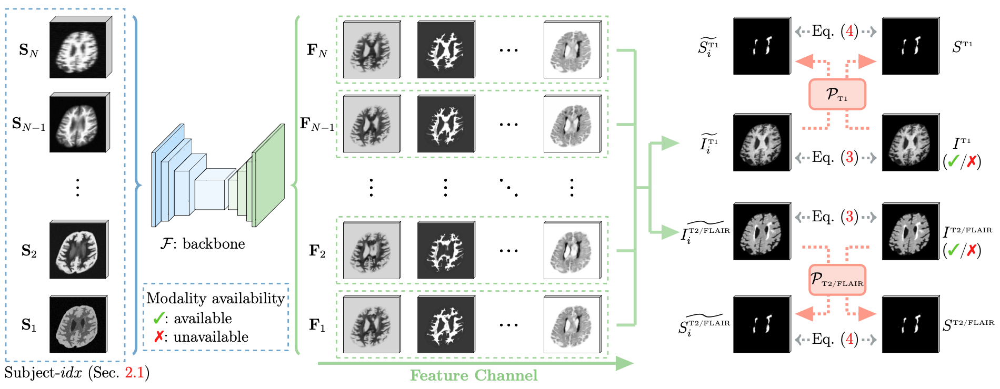

## [PEPSI: Pathology-Enhanced Pulse-Sequence-Invariant Representations for Brain MRI]()


**<p align="center">Peirong Liu, Oula Puonti, Annabel Sorby-Adams, William T. Kimberly, Juan E. Iglesias</p>**

<p align="center">
Athinoula A. Martinos Center for Biomedical Imaging,<br /> Harvard Medical School and Massachusetts General Hospital
</p>

<p align="center">
  
</p>


## Environment
Training and evaluation environment: Python 3.11.4, PyTorch 2.0.1, CUDA 12.2. Run the following command to install required packages.
```
conda create -n pepsi python=3.11
conda activate pepsi

cd /path/to/pepsi
pip install -r requirements.txt
```
Please also install [pytorch3dunet](https://github.com/wolny/pytorch-3dunet) according to the official instructions:
```
wget https://github.com/wolny/pytorch-3dunet
cd /path/to/pytorch-3dunet
python setup.py install
```


## Demo


### Playing with PEPSI Anatomy & Pathology Image Synthesizer and Feature Extractor

Please download PEPSI pre-trained weights (pepsi_pretrained.pth), and test images with pathologies (T1w.nii.gz, FLAIR.nii.gz) in this [Google Drive folder](https://drive.google.com/drive/folders/1Wbnjc8sf8T_YIjc91k0b2gMOQ5kz0Dw9?usp=sharing), and move them into the './assets' folder.


Obtain PEPSI synthesized MP-RAGE & FLAIR & features using the following code.
```python3
import os, torch
from utils.demo_utils import prepare_image, evaluate_image
from utils.misc import viewVolume, make_dir

img_path = 'assets/T1w.nii.gz' # Try: assets/T1w.nii.gz, assets/FLAIR.nii.gz
ckp_path = 'assets/pepsi_pretrained.pth'


im, aff = prepare_image(img_path, device = 'cuda:0')
outputs = evaluate_image(im, ckp_path, feature_only = False, device = 'cuda:0')


# Check outputs
for k in outputs.keys(): 
    print('out:', k)


# Get PEPSI synthesized MP-RAGE (Anatomy Image with Darkened Anomalies)
mprage = outputs['image']
print(mprage.size()) # (1, 1, h, w, d)
viewVolume(mprage, aff, names = ['out_mprage_from_%s' % os.path.basename(img_path).split('.nii.gz')[0]], save_dir = make_dir('outs'))

# Get PEPSI synthesized FLAIR (Pathology Image with Brightened Anomalies)
flair = outputs['aux_image']
print(flair.size()) # (1, 1, h, w, d)
viewVolume(flair, aff, names = ['out_flair_from_%s' % os.path.basename(img_path).split('.nii.gz')[0]], save_dir = make_dir('outs'))


# Get PEPSI features
feats = outputs['feat'][-1]
print(feats.size()) # (1, 64, h, w, d)
# Uncomment the following if you want to save the features
# NOTE: feature size could be large
#num_plot_feats = 1 # 64 features in total from the last layer
#for i in range(num_plot_feats): 
#  viewVolume(feats[:, i], aff, names = ['feat-%d' % (i+1)], save_dir = make_dir('outs/feats-%s' % os.path.basename(img_path).split('.nii.gz')[0]))
```

You could customize your own paths in `scripts/demo_pepsi.py`.
```
cd /path/to/pepsi
python scripts/demo_pepsi.py
```


### Playing with PEPSI Synthetic Generator

```
cd /path/to/pepsi
python scripts/demo_synth.py
```
You could customize your own data generator in `cfgs/demo_synth.yaml`.


## Training on Synthetic Data Encoded with Pathology

<p align="center">
  
</p>


Use the following code to train a feature representation model on synthetic data: 
```
cd /path/to/pepsi
python scripts/train.py anat_flair.yaml
```
We also support Slurm submission:
```
cd /path/to/pepsi
sbatch scripts/train.sh
```
You could customize your anatomy supervision by changing the configure file `cfgs/train/anat_flair.yaml`.

## Evaluating on Real Data
Use the following code to fine-tune a task-specific pathology segmentation model on real data, using PEPSI pre-trained weights: 
```
cd /path/to/pepsi
python scripts/eval.py task_seg.yaml
```
We also support Slurm submission:
```
cd /path/to/pepsi
sbatch scripts/eval.sh
```
You could customize your own task by creating your own `cfgs/train/task_seg.yaml` file.


## Download the Public Datasets

- PEPSI pre-trained model and test images: [Google Drive](https://drive.google.com/drive/folders/1Wbnjc8sf8T_YIjc91k0b2gMOQ5kz0Dw9?usp=sharing)

- ATLAS dataset: Request data from [official website](https://fcon_1000.projects.nitrc.org/indi/retro/atlas.html). 

- ISLES2022 dataset: Request data from [official website](https://www.isles-challenge.org/).

- ADNI3 dataset: Request data from [official website](https://adni.loni.usc.edu/data-samples/access-data/).  

- ISBI2015 dataset: Request data from [official website](https://iacl.ece.jhu.edu/index.php/MSChallenge/data). 

- MSSEG2016 dataset: Request data from [official website](https://portal.fli-iam.irisa.fr/msseg-challenge/english-msseg-data/). 

- Segmentation labels for data simulation: To train a PEPSI feature representation model of your own from scratch, one needs the segmentation labels for synthetic image simulation and their corresponding MP-RAGE/FLAIR images for dual-guidance (anatomy + pathology) supervision. We obtained our anatomy labels via three steps:
     (1) Skull-strip: [SynthStrip toolbox](https://surfer.nmr.mgh.harvard.edu/docs/synthstrip/); 
     (2) Inpaint the lesions: [SynthSR toolbox](https://surfer.nmr.mgh.harvard.edu/fswiki/SynthSR); 
     (3) Obtain anatomy segmentation labels: [SynthSeg toolbox](https://surfer.nmr.mgh.harvard.edu/fswiki/SynthSeg).


## Datasets
After downloading the datasets needed, structure the data as follows, and set up your dataset paths in `PEPSI/datasets/__init__.py`.
```
/path/to/dataset/
  T1/
    subject_name.nii
    ...
  T2/
    subject_name.nii
    ...
  FLAIR/
    subject_name.nii
    ... 
  or_any_other_modality_you_have/
    subject_name.nii
    ...
  segmentation_maps/
    subject_name.nii
    ...
  pathology_maps/
    subject_name.nii
    ...
```


## Citation
```bibtex
@InProceedings{Liu_2024_PEPSI,
    author    = {Liu, Peirong and Puonti, Oula and Sorby-Adams, Annabel and Kimberly, William T. and Iglesias, Juan E.},
    title     = {PEPSI: Pathology-Enhanced Pulse-Sequence-Invariant Representations for Brain MRI},
    journal   = {arXiv},
    year      = {2024},
    volume    = {abs/2403.06227},
}

